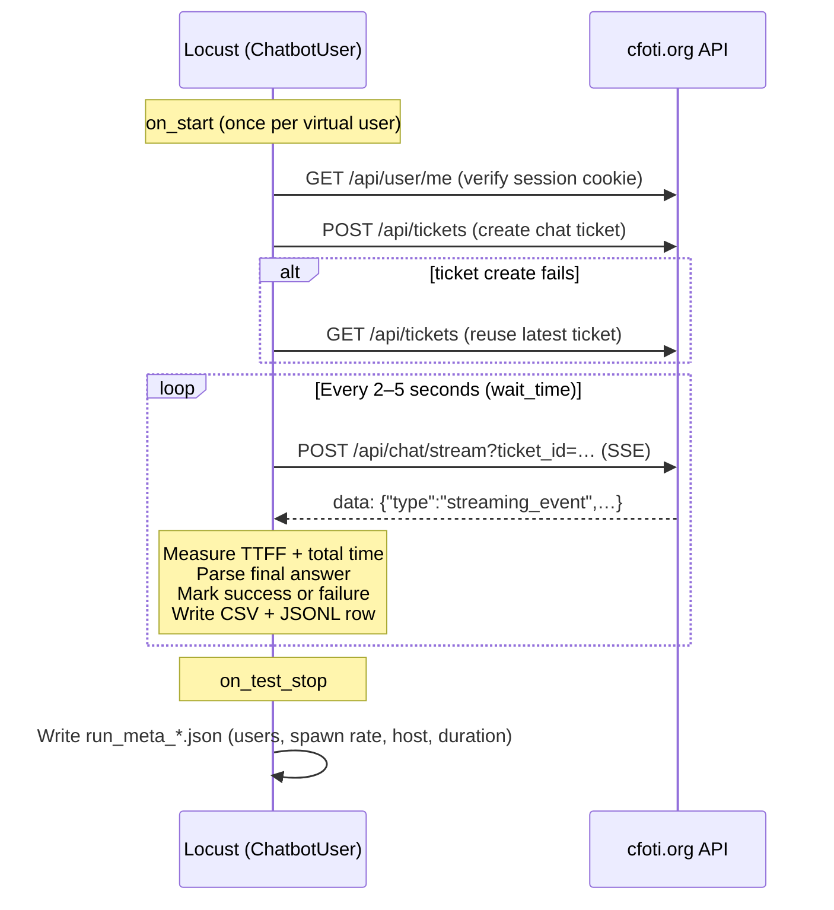

# Load test code walkthrough (key sections)

This document explains **what the load test code does**, section by section. It is written for engineering and QA stakeholders reviewing the implementation — not as a full source listing.

The main file is **`src/locustfile.py`**. Supporting configuration lives in **`config/test_config.py`** and test questions in **`src/sample_questions.py`**.

For failure semantics and report interpretation, see [CLIENT_CHAT_FAILURES_EXPLAINED.md](CLIENT_CHAT_FAILURES_EXPLAINED.md).

---

## Executive summary

| What | How |
|------|-----|
| **Tool** | [Locust](https://locust.io/) — each virtual user simulates one logged-in person chatting |
| **Auth** | Pre-set `session` cookie from a real browser login (not username/password in the script) |
| **Chat API** | `POST /api/chat/stream` — Server-Sent Events (SSE), same stream DevTools shows under Network |
| **Per user** | Authenticate → create/find a ticket → send random trade questions → read streamed answer |
| **Success** | HTTP 200/201, stream completes, final answer text extracted, answer is not a known error template |
| **Failure** | Stream cut off, HTTP error, empty answer, or chatbot error message (connection/system/insufficient info) |
| **Outputs** | Locust HTML/CSV **plus** per-chat CSV and JSONL transcripts with full Q&A |

---

## High-level flow



---

## 1. Configuration and imports

**Files:** `config/test_config.py`, `config/test_config.yaml`, `.env`

The locustfile does not hard-code URLs or user counts. It reads:

- **API base URL and paths** — chat stream, tickets, user profile
- **`TEST_TYPE`** — `load`, `stress`, `endurance`, or `breakpoint` (selects user/spawn/duration profile)
- **`SESSION_COOKIE`** — copied from the browser after login
- **Wait time between chats** — random 2–5 s by default (simulates think time)

```30:47:src/locustfile.py
from config.test_config import (
    CHATBOT_URL,
    API_ENDPOINT_CHAT,
    API_ENDPOINT_TICKETS,
    API_ENDPOINT_USERME,
    SESSION_COOKIE,
    WAIT_TIME_MIN,
    WAIT_TIME_MAX,
    TEST_TYPE,
    ACTIVE_USERS,
    ACTIVE_SPAWN_RATE,
    ACTIVE_RUN_TIME,
    BREAKPOINT_MAX_USERS,
    BREAKPOINT_RAMP_USERS_PER_STEP,
    BREAKPOINT_STEP_DURATION,
    REPORTS_DIR,
    LOG_ALL_RAW_SSE,
)
```

**Why this matters:** The same locustfile runs every test profile; only config changes. The session cookie is the only secret — it is not committed to git.

---

## 2. Error classification helpers

**Purpose:** Decide whether a completed chat response should count as a **failure**, even when HTTP status is 200.

The chatbot returns fixed error strings for connection issues, system errors, and “insufficient information.” The test treats an exact match (or a blank answer) as a content failure.

```53:74:src/locustfile.py
_ERROR_ANSWERS = [
    "TAIA has encountered a connection error, please click message button on the right and we will contact you.",
    "TAIA has encountered an error, please try again later. If you continue to experience this problem, please reach out to our support team via the message button for assistance. We appreciate your patience and apologize for any inconvenience.",
    "I am unable to retrieve sufficient information at this time. For further guidance, please click the 'Email' button in the bottom right corner of the screen to arrange a call or a one-to-one advisory session. Our specialists can provide tailored insights based on your product and trade needs and help address any related queries or challenges.",
]

def _classify_error(answer: str) -> str:
    """Return error label if the answer is blank or matches a known error, else empty string."""
    if not answer or not answer.strip():
        return "Empty Response"
    stripped = answer.strip()
    for msg, label in _ERROR_LABELS.items():
        if stripped == msg:
            return label
    return ""
```

**TTFF helper** — Time To First Feedback measures when the user first sees *any* chatbot output (e.g. “Analysing your question…”), skipping the initial `ticket_id` metadata event:

```77:91:src/locustfile.py
def _is_feedback_event(decoded_line: str) -> bool:
    """Return True if the SSE data line is the first user-visible feedback.

    Skips metadata (ticket_id) so that TTFF reflects when the user first
    sees any response from the chatbot (e.g. "Analysing your question...").
    """
    try:
        raw = decoded_line.strip()[5:].strip()
        if not raw:
            return False
        evt = json.loads(raw)
        return evt.get("type") != "ticket_id"
    except (json.JSONDecodeError, TypeError, IndexError):
        pass
    return False
```

---

## 3. Swarm parameter capture

**Purpose:** Record the **actual** user count and spawn rate used in the run (web UI or CLI), for the run metadata file.

Locust’s local runner does not always persist UI swarm settings; the code wraps `Runner.start` to capture them:

```94:106:src/locustfile.py
# Capture UI swarm params (LocalRunner does not persist spawn_rate from web UI)
_swarm_params = {"users": None, "spawn_rate": None}

_original_runner_start = Runner.start

def _capturing_start(self, user_count: int, spawn_rate: float, wait=False, user_classes=None):
    _swarm_params["users"] = user_count
    _swarm_params["spawn_rate"] = spawn_rate
    return _original_runner_start(self, user_count, spawn_rate, wait, user_classes)

Runner.start = _capturing_start
```

---

## 4. Test lifecycle hooks (report file setup)

### `on_test_start`

Runs once when the swarm begins:

1. Resolves the **reports directory** from Locust’s `--csv` / `--html` paths so per-chat files sit next to Locust exports
2. Creates the **per-chat CSV** header if missing
3. Warns if `SESSION_COOKIE` is empty

Output file names follow the Locust prefix, e.g. `client_run_response_times_load.csv` and `client_run_chat_transcripts_load.jsonl`.

```206:244:src/locustfile.py
@events.test_start.add_listener
def on_test_start(environment, **kwargs):
    global RESPONSE_TIME_CSV, CHAT_TRANSCRIPT_JSONL
    reports = _effective_reports_dir(environment)
    reports.mkdir(parents=True, exist_ok=True)
    locust_prefix = _locust_export_prefix(environment)
    if locust_prefix:
        RESPONSE_TIME_CSV = reports / f"{locust_prefix}_response_times_{TEST_TYPE}.csv"
        CHAT_TRANSCRIPT_JSONL = reports / f"{locust_prefix}_chat_transcripts_{TEST_TYPE}.jsonl"
    # ...
    if not RESPONSE_TIME_CSV.exists() or RESPONSE_TIME_CSV.stat().st_size == 0:
        with open(RESPONSE_TIME_CSV, "w", newline="", encoding="utf-8") as f:
            csv.writer(f).writerow([
                "timestamp", _RESPONSE_TIMES_USER_COL, "test_type", "question_category",
                "question", "answer", "response_time_ms", "ttff_ms",
                "status_code", "status", "failure_reason",
            ])
```

### `on_test_stop`

Runs once at the end (master runner only). Writes **`run_meta_<TEST_TYPE>.json`** with users, spawn rate, host, and run duration — using captured swarm params when available.

---

## 5. Breakpoint test shape (optional)

**When:** `TEST_TYPE=breakpoint` only.

Instead of a fixed user count, users ramp up in steps (e.g. +20 every 60 s) until max users or run time is reached. This finds the load level where failures or latency spike.

```333:348:src/locustfile.py
if TEST_TYPE == "breakpoint":
    class BreakpointShape(LoadTestShape):
        """Ramps users in steps until max_users or run_time is reached."""

        def tick(self):
            run_time = self.get_run_time()
            total_seconds = _parse_run_time(ACTIVE_RUN_TIME)
            if run_time > total_seconds:
                return None

            current_step = math.floor(run_time / BREAKPOINT_STEP_DURATION)
            target_users = min(
                (current_step + 1) * BREAKPOINT_RAMP_USERS_PER_STEP,
                BREAKPOINT_MAX_USERS,
            )
            return (target_users, max(BREAKPOINT_RAMP_USERS_PER_STEP, 1))
```

For `load`, `stress`, and `endurance`, user count is set in the Locust UI or CLI — no custom shape class.

---

## 6. Virtual user: `ChatbotUser`

This is the core simulation. One instance = one concurrent “person” using the chatbot.

### Design choices

| Choice | Reason |
|--------|--------|
| **`HttpUser`** (not FastHttpUser) | Reliable SSE / chunked streaming support |
| **`stream=True`, `timeout=None`** | Chat responses can take minutes; must read line-by-line |
| **Session cookie auth** | Matches how the real web app authenticates |
| **One ticket per user** | Mirrors a dedicated chat thread per session |

```365:373:src/locustfile.py
class ChatbotUser(HttpUser):
    """
    Uses HttpUser (not FastHttpUser) for SSE streaming compatibility.
    Auth via pre-set session cookie from .env.
    Each user gets their own chat ticket.
    """

    host = CHATBOT_URL
    wait_time = between(WAIT_TIME_MIN, WAIT_TIME_MAX)
```

### 6a. Startup: authenticate and open a ticket

**`on_start`** runs once per virtual user:

1. Set `session` and `isLoggedIn` cookies
2. **`GET /api/user/me`** — confirm the cookie is valid; optionally mirror the `user` cookie the browser sets
3. **`POST /api/tickets`** — create a new chat ticket; if that fails, **`GET /api/tickets`** and reuse the most recent one

```375:410:src/locustfile.py
    def on_start(self):
        self.ticket_id = None
        self.is_authenticated = False

        if not SESSION_COOKIE:
            print("ERROR: No SESSION_COOKIE set. Cannot authenticate.")
            return

        self.client.cookies["session"] = SESSION_COOKIE
        self.client.cookies["isLoggedIn"] = "true"

        with self.client.get(
            API_ENDPOINT_USERME, name="Verify Auth", catch_response=True
        ) as resp:
            if resp.status_code == 200:
                self.is_authenticated = True
                # ... populate user cookie from profile JSON ...
                resp.success()
            else:
                resp.failure(f"Auth failed: {resp.status_code} – session cookie may be expired")
                return

        self._create_ticket()
```

If auth fails (expired cookie), that user stops sending chats until the cookie is refreshed.

### 6b. Primary task: send a chat message

**`send_chat_message`** is the only `@task` — Locust repeats it for the life of the user (with wait time between calls).

**Steps:**

1. Pick a random question from `sample_questions.py` (weighted toward “Indirect” multi-part queries)
2. **`POST /api/chat/stream?ticket_id=…`** with `{"message_content": "…"}`
3. Read SSE lines with `resp.iter_lines()`
4. Record **TTFF** on first non-`ticket_id` `data:` event
5. Record **total response time** when the stream ends
6. Parse final answer from events → classify success vs failure → log to CSV/JSONL

```452:477:src/locustfile.py
    @task
    def send_chat_message(self):
        if not self.is_authenticated:
            return
        if not self.ticket_id:
            self._create_ticket()
            if not self.ticket_id:
                return

        message = random.choice(SAMPLE_MESSAGES)
        category = get_question_category(message)

        payload = {"message_content": message}

        start = time.time()
        ttff_ms = None
        try:
            with self.client.post(
                f"{API_ENDPOINT_CHAT}?ticket_id={self.ticket_id}",
                json=payload,
                name=f"Chat [{category}]",
                catch_response=True,
                timeout=None,
                stream=True,
            ) as resp:
```

**Request naming:** Locust reports show `Chat [Direct]` vs `Chat [Indirect]` so you can compare latency and failure rates by question type.

### 6c. Stream failure handling

Under load, proxies or the server may close the SSE connection early (`ChunkedEncodingError`, `IncompleteRead`, etc.). These are counted as **failures** even if some partial data arrived:

```491:512:src/locustfile.py
                except _STREAM_READ_ERRORS as e:
                    response_time_ms = (time.time() - start) * 1000
                    detail = type(e).__name__
                    if isinstance(e, ChunkedEncodingError):
                        detail = "chunked stream closed early (server/proxy/load)"
                    full_text = "\n".join(lines)
                    partial_answer = _parse_sse_response(full_text) if full_text else ""
                    locust_reason = f"Stream read failed: {e}"
                    resp.failure(locust_reason)
                    self._log(
                        category,
                        message,
                        partial_answer,
                        response_time_ms,
                        ttff_ms,
                        resp.status_code,
                        f"Stream interrupted – {detail}",
                        failure_reason=locust_reason,
                        raw_sse=full_text,
                        locust_marked_failure=True,
                    )
                    return
```

### 6d. Success vs content failure (HTTP 200)

After a complete stream:

| Condition | Locust result | Logged status |
|-----------|---------------|---------------|
| Valid final answer, not an error template | `resp.success()` | `Success` |
| Blank answer or known error text | `resp.failure("Content error: …")` | `Error - Empty Response` / `Connection Error` / etc. |
| HTTP 401 | `resp.failure(...)` | Cookie expired; user marked unauthenticated |
| Other HTTP status | `resp.failure(...)` | `Error <code>` |

```518:539:src/locustfile.py
                if resp.status_code in [200, 201]:
                    answer_text = _parse_sse_response(full_text)
                    error_type = _classify_error(answer_text)
                    if error_type:
                        locust_reason = f"Content error: {error_type}"
                        resp.failure(locust_reason)
                        self._log(/* ... failure ... */)
                    else:
                        resp.success()
                        self._log(/* ... success ... */)
```

---

## 7. Answer parsing from SSE

**`_parse_sse_response`** walks `data:` lines and extracts the final user-visible answer from `streaming_event` payloads (primary path) or legacy `message` events.

This is the same JSON the browser receives — **not** HTML from the chat UI.

```657:685:src/locustfile.py
def _parse_sse_response(text: str) -> str:
    """Parse cfoti SSE stream to extract the chatbot's final answer.

    Event format:
      data: {"type": "streaming_event", "data": {"payload": {
        "step_type": "reasoning", "status": "success", "output": "...answer..."
      }}}
    """
    for line in text.split("\n"):
        line = line.strip()
        if not line.startswith("data:"):
            continue
        try:
            evt = json.loads(line[5:].strip())
            if evt.get("type") == "streaming_event":
                payload = evt.get("data", {}).get("payload", {})
                if payload.get("status") == "success" and isinstance(payload.get("output"), str):
                    return payload["output"]
            # ... message-type fallback ...
        except (json.JSONDecodeError, TypeError):
            continue
    return ""
```

If the API event shape changes in production, this function is the single place to update parsing logic.

---

## 8. Per-chat logging

**`_log`** appends one row per chat to two files:

| File | Contents |
|------|----------|
| **`*_response_times_*.csv`** | Spreadsheet-friendly: full question, full answer, timings, status, `failure_reason`, concurrent user count |
| **`*_chat_transcripts_*.jsonl`** | Structured evidence; **failures include `raw_sse`** (full API stream) for DevTools comparison |

```587:652:src/locustfile.py
    def _log(
        self,
        category,
        question,
        answer,
        response_time_ms,
        ttff_ms,
        status_code,
        status,
        *,
        failure_reason="",
        raw_sse="",
        locust_marked_failure=False,
    ):
        """Append one chat row to CSV (full Q&A) and JSONL transcript (evidence for failures)."""
        # ... writes CSV row ...
        include_raw = bool(raw_sse) and (locust_marked_failure or LOG_ALL_RAW_SSE)
        record = {
            "timestamp": ts,
            "concurrent_users": users,
            "question": question,
            "extracted_answer": answer_text,
            "response_time_ms": round(response_time_ms, 2),
            "ttff_ms": ttff_val,
            "failure_reason": failure_reason,
            "sse_event_summary": _summarize_sse_events(raw_sse) if raw_sse else [],
            # raw_sse included on failures (or all chats if LOG_ALL_RAW_SSE=true)
        }
```

**`concurrent_users`** is the Locust runner’s live user count at log time — useful when correlating failures with load level.

---

## 9. Test questions (`src/sample_questions.py`)

Not in the locustfile, but drives realistic traffic:

- **`DIRECT_QUESTIONS`** — single-topic trade/FTA queries (Locust label: `Chat [Direct]`)
- **`INDIRECT_QUESTIONS`** — multi-part, re-export, origin-rule scenarios (`Chat [Indirect]`)
- **Weights** — default 2:8 ratio so indirect (heavier) questions dominate, matching expected production mix

Questions are real trade-domain prompts (HS codes, FTAs, PCO process, etc.), not generic “hello” messages.

---

## 10. What the code deliberately does *not* do

| Not included | Why |
|--------------|-----|
| Browser / DOM automation | Test hits the **API stream** directly — faster, repeatable, same payload as the web app |
| Login flow in script | Session cookie is copied manually; avoids captcha/MFA complexity |
| Answer quality scoring | Pass/fail is **technical** (stream complete, answer present, not error template) — not LLM judge |
| Per-user unique accounts | All users share one session cookie (typical for controlled load tests; rotate cookie between runs) |

---

## 11. Code section map (quick reference)

| Section | Lines (approx.) | Responsibility |
|---------|-----------------|----------------|
| Imports & config | 1–51 | Wire URLs, test profile, sample messages |
| Error helpers | 53–91 | Classify blank/known error answers; TTFF detection |
| Swarm capture | 94–106 | Remember UI user count / spawn rate |
| Report setup | 109–327 | CSV/JSONL paths, test start/stop hooks, run metadata |
| Breakpoint shape | 330–359 | Stepped user ramp (breakpoint tests only) |
| `ChatbotUser` | 362–654 | Auth, tickets, chat task, logging |
| SSE parser | 657–685 | Extract final answer from stream events |

---

## Related documents

- [CLIENT_CHAT_FAILURES_EXPLAINED.md](CLIENT_CHAT_FAILURES_EXPLAINED.md) — failure types, DevTools mapping, stakeholder talking points
- [CLIENT_LOCUST_STATS_HISTORY.md](CLIENT_LOCUST_STATS_HISTORY.md) — Locust HTTP aggregate CSV columns
- [README.md](../README.md) — setup, run commands, deliverable file list
